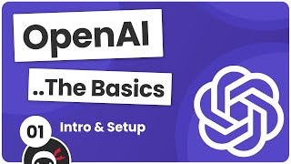
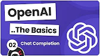
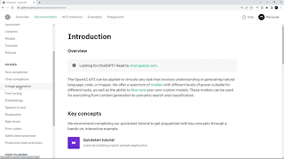
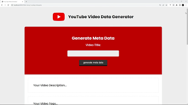

 
 
<header style="display: inline-block;
               flex-flow: column;
               flex-direction: column;
               width: 100%;
               align-items: center;
               margin-left: auto;
               margin-right: auto;"
>
</img>
<h4 style="display: inline-flex; 
           margin-left: 2px;
           margin-right: auto;
           font-family: Chango;
           font-size: 13px;
           font-weight: 100;
           text-shadow: 0px 0px 17px #ccc;
           color: hsla(219, 79%, 66%, 0.998);
           letter-spacing: 1px;"
>Team Webelistics®️</h4>
 
 
</img>
</header>
 
 
 
 

#  OpenAI Tutorial #1 - Intro & Setup

-   [OpenAI Tutorial #1](https://www.youtube.com/watch?v=C4ve8Kjw9ZY)
-   In this OpenAI tutorial series you'll learn the basics of how to leverage AI to make a small application that generates text and images.
-   [Access the course files on GitHub:](https://www.youtube.com/redirect?event=video_description&redir_token=QUFFLUhqa2xLQ0paRHd4RUdEOEw4OXFFVGRBUXdJTURwd3xBQ3Jtc0tucGJzV01DVEVIMjRUelA2V1kybjVCX3FNZjYxZXRsN0Nkdlp6WV9COTk1aU40S3BuZkhSTEpWMkdrNjJJYkRVaHZMTWREZkhtbGdXX0JfdklZaHdPNUswZnVKcDFjMU9LcE9lTzQweWZEWjBPb0VScw&q=https%3A%2F%2Fgithub.com%2Fiamshaunjp%2FopenAI-basics&v=C4ve8Kjw9ZY)

###  NPM Packages/Dependencies

-   npm init
-   npm install openai
-   npm i dotenv
-   npm install express
-   npm i open -D
-   npm i morgan
-   npm i cors
-   npm i chalk

 
 
</img>
 
 

#  OpenAI Tutorial #2 - Chat Completion

-   [OpenAI Tutorial (the Basics)](https://www.youtube.com/playlist?list=PL4cUxeGkcC9ipdXMDVcGimIVMG_Z6-Vsu)

 
 

</img>

 
 

#  OpenAI Tutorial #3 - Image Generation

-   In this OpenAI tutorial series you'll learn the basics of how to leverage AI to make small application that generates text and images.
-   [OpenAI Tutorial#3](https://www.youtube.com/watch?v=-VLUQTOnmMY&t=9s)
     
     

</img>

 
 

#  OpenAI Tutorial #4 - Making an Express API

-   In this OpenAI tutorial series you'll learn the basics of how to leverage AI to make small application that generates text and images.
-   [OpenAI Tutorial#4](https://www.youtube.com/watch?v=ynyohARvZD4&t=5s)
-   [ Access the course files on GitHub:](https://www.youtube.com/redirect?event=video_description&redir_token=QUFFLUhqazJOOUxPT2RIVWl2VU5BWHJORmdScThkRENrQXxBQ3Jtc0tra24wZkRTa3dnN2l3bmVMUndTZlkyUGpPT29Jbkd6d2RJenMxYUI0dlZ2ajNWUjJQaGdJM0pzNmUweWFOenNuNktVYXJjdHVKNnRQSkt0ZERmeXpZQkRFN0dhOWw4U2o3WGhGMEJnR09YNkcweTBOWQ&q=https%3A%2F%2Fgithub.com%2Fiamshaunjp%2FopenAI-basics&v=ynyohARvZD4)
     
     

</img>

 
 

#  OpenAI Tutorial #5 - Adding a Frontend

-   In this OpenAI tutorial series you'll learn the basics of how to leverage AI to make small application that generates text and images.
-   [OpenAI Tutorial#5](https://www.youtube.com/watch?v=2RXu31Clpmk)
-
-   [ Access the course files on GitHub:](https://www.youtube.com/redirect?event=video_description&redir_token=QUFFLUhqazJOOUxPT2RIVWl2VU5BWHJORmdScThkRENrQXxBQ3Jtc0tra24wZkRTa3dnN2l3bmVMUndTZlkyUGpPT29Jbkd6d2RJenMxYUI0dlZ2ajNWUjJQaGdJM0pzNmUweWFOenNuNktVYXJjdHVKNnRQSkt0ZERmeXpZQkRFN0dhOWw4U2o3WGhGMEJnR09YNkcweTBOWQ&q=https%3A%2F%2Fgithub.com%2Fiamshaunjp%2FopenAI-basics&v=ynyohARvZD4)
